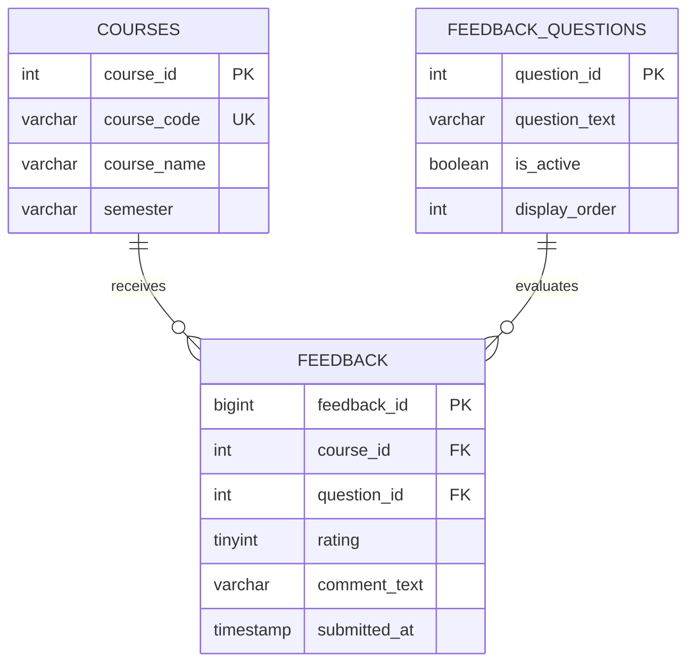

# ER diagram

Paste the Mermaid diagram below into a Mermaid-compatible Markdown viewer.

```mermaid
erDiagram
    COURSES ||--o{ FEEDBACK : receives
    FEEDBACK_QUESTIONS ||--o{ FEEDBACK : evaluates
    COURSES {
        int course_id PK
        varchar course_code UK
        varchar course_name
        varchar semester
    }
    FEEDBACK_QUESTIONS {
        int question_id PK
        varchar question_text
        boolean is_active
        int display_order
    }
    FEEDBACK {
        bigint feedback_id PK
        int course_id FK
        int question_id FK
        tinyint rating
        varchar comment_text
        timestamp submitted_at
    }
```
